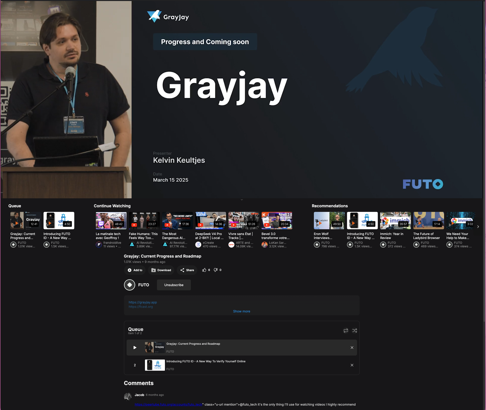
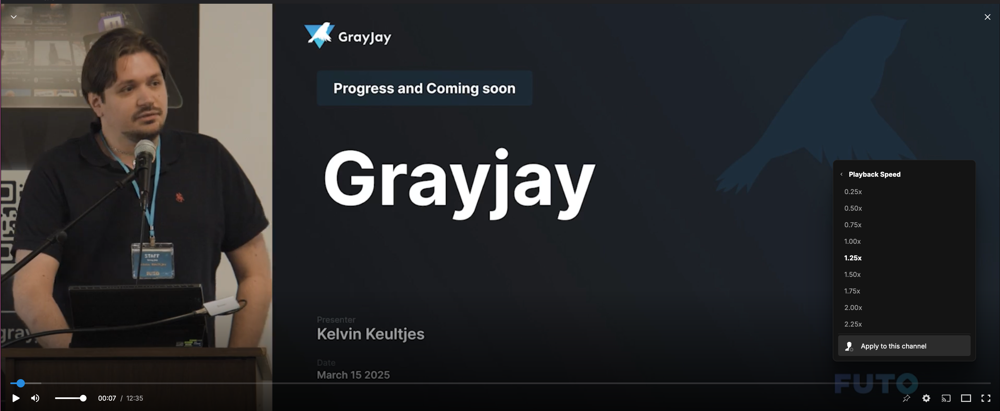
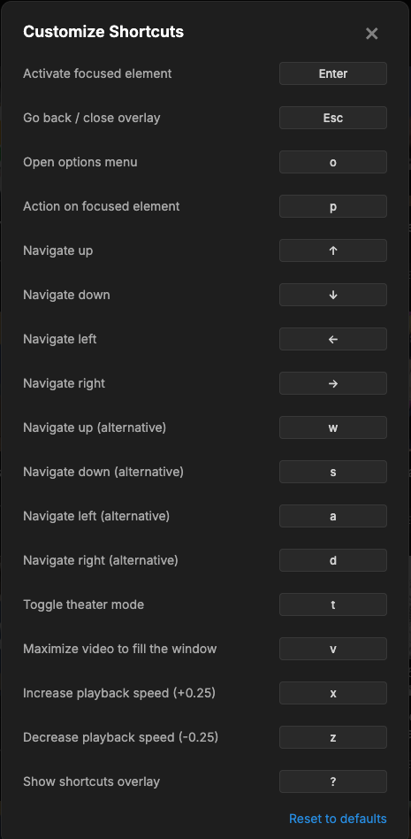

> ## A personal fork — with the deepest respect for [Grayjay](https://grayjay.app/) and [FUTO](https://futo.org/)
>
> This repository is a personal fork of [`futo-org/Grayjay.Desktop`](https://github.com/futo-org/Grayjay.Desktop). I'm not affiliated with FUTO in any way — just a heavy daily user who happens to keep a couple of small local tweaks.
>
> Grayjay is, very plainly, the application I use the most after my terminal. The team has built something genuinely useful — and they did it the hard way: open code, plugin architecture, no telemetry, no dark patterns, real respect for users. That deserves to be said out loud, and to be supported.
>
> ### Why a fork, then?
>
> Honestly, just to scratch a few of my own itches without imposing them on anyone. The changes here are small quality-of-life tweaks (carousels under the player in theater mode, queue-consume on play, per-channel playback speed, hold-to-fast-forward, a `?` shortcuts overlay…). Nothing groundbreaking, nothing replacing what FUTO does — just personal stuff for my own usage.
>
> ### Why no flood of PRs to upstream?
>
> Out of **respect**. I don't want to look like someone trying to muscle their ideas into a project they didn't build, especially when several of my changes are still settling and might evolve. I'd rather let things mature here, then propose them upstream calmly, one focused PR at a time, only when they feel ready and clearly useful to others — never as a take-it-or-leave-it batch.
>
> If FUTO maintainers ever want to look at any of these branches, **of course** I'd be happy to share, refactor as they wish, or simply close PRs that don't fit the project's direction. The decision is theirs.
>
> ### Why is this repo public, then?
>
> Mostly so my own builds across machines stay reproducible, and so anyone curious can see the diff. **It is not** an attempt to redistribute Grayjay, fork the community, or compete in any way. If at any point this fork ever risked confusing users about what "Grayjay" is, or pulling attention away from the official project, I'd rather make this repository private — that's a real line for me.
>
> ### What you should actually use
>
> The official Grayjay Desktop, from the official site:
> - **Website**: [grayjay.app/desktop](https://grayjay.app/desktop/)
> - **Upstream repo**: [github.com/futo-org/Grayjay.Desktop](https://github.com/futo-org/Grayjay.Desktop) (mirror of the primary GitLab)
> - **FUTO**: [futo.org](https://futo.org/)
>
> If you're a FUTO maintainer reading this and any of the above feels off, please [open an issue](https://github.com/guthubrx/Grayjay.Desktop/issues) or DM me — I'll adjust gladly.
>
> Thank you for Grayjay. Sincerely.
>
> — *guthubrx*

---

## What this fork adds

Each item below is a small, focused feature kept on its own branch (`pr/...`) so it can be discarded, reworked, or — eventually, with FUTO's blessing — proposed upstream as a single clean PR. The goal is always to fit the look, conventions and minimalism of the original code.

> *Screenshots live in `docs/screenshots/` (drop any file you'd like to illustrate a feature; the README will reference them).*

### 1. Horizontal carousels in theater mode &mdash; `pr/horizontal-carousels-theater`

In theater mode, the queue, continue-watching list and recommendations can be displayed as horizontal carousels under the player instead of (or alongside) the vertical sidebar. Each is a separate setting under **Player → Carousels**, plus a "side-by-side" toggle. A thin collapsible bar under the player lets you hide/show all carousels at once. The state is persisted (`carouselsCollapsed`).

Also includes a "Mark watched" / "Remove from history" entry in the context menu of continue-watching items.



### 2. Queue items consumed on play &mdash; `pr/queue-consume-on-play`

When `repeat` is off, the currently-played video is removed from the queue once it finishes (auto-end) or when you manually pick another item or press next/prev. When `repeat` is on, the queue is preserved as before. No more leftover "already watched" entries piling up.

### 3. Per-channel playback speed &mdash; `pr/per-channel-playback-speed`

In the playback-speed submenu, two new entries: **Apply to this channel** (pin the current speed for every video from this channel) and **Reset for this channel**. Stored client-side under a single `channelPlaybackSpeeds` key — no schema change.



### 4. Hold-to-fast-forward &mdash; `pr/long-press-playback-speed`

Press-and-hold on the player → playback temporarily jumps to a configurable speed (1.5×/2.0×/2.5×/3.0×, default 2.0×). Release → back to normal. New setting **Player → Long Press Playback Speed**.

### 5. Keyboard shortcuts overlay &mdash; `pr/keyboard-shortcuts-overlay`

Press `?` anywhere → an overlay lists every global keyboard shortcut. Layout-agnostic (`Shift+/` on US, `Shift+,` on French Mac, etc., all map to `?` via `e.key`).


### 6. Customizable keyboard shortcuts &mdash; `pr/keyboard-shortcuts-customize` (depends on #5)

From the overlay, a **Customize…** link opens a rebind dialog. 13 actions are remappable (`press`, `back`, `options`, `action`, navigation arrows + alt nav `w/a/s/d`, `showShortcuts`). Click an action → press a key → done. **Reset to defaults** button. Visual warning on conflicts. Stored client-side under `keyboardShortcuts`.



### 7. Player keyboard shortcuts &mdash; `pr/player-keyboard-shortcuts` (depends on #6)

Four extra customizable actions for the active video:

| Default | Action |
|:---:|---|
| `t` | Toggle theater mode |
| `v` | Maximize video to fill the window (UI hidden, not OS fullscreen) |
| `x` | Speed +0.25 |
| `z` | Speed -0.25 |

`Esc` (or whatever you've bound `back` to) exits window-maximize.

---


Grayjay is a multi-platform media application that allows you to watch content from multiple platforms in a single application. Using an extendable plugin system developers can make new integrations with additional platforms. Plugins are cross-compatible between Android and Desktop.

FUTO is an organization dedicated to developing, both through in-house engineering and investment, technologies that frustrate centralization and industry consolidation.

For more elaborate showcase of features and downloads, check out the website.
Website: https://grayjay.app/desktop/

**NOTE for MacOS Users:** Our Apple signing/notarization is not entirely done yet, thus you have to run the following command once to run the application.
```
xattr -c ./Grayjay_osx-arm64.app

```
or
```
xattr -c ./Grayjay_osx-x64.app
```


### Home
Here you find the recommendations found on respective applications.


### Sources
Here you install new source plugins, change which sources are used, or configure your source behavior.


### Details
Here is an example of what the video player looks like, we support various views so that you can view the video how you like. By default we show a theater view that becomes smaller when reading comments, while not entirely hiding it.

|  |  |
|--|--|
|  |  |

### Downloads
Grayjay also supports downloads, allowing offline viewing of videos, as well as exporting them to files usable outside of Grayjay.


### Channel


### More..
Grayjay Desktop has way more features than this, but for that, check out the website or download it yourself!


## NixOS config

Below a NixOS configuration in case you like to use Grayjay on NixOS.
```
(pkgs.buildFHSEnv {
  name = "fhs";
  targetPkgs = _: with pkgs; [
    libz
    icu
    libgbm
    openssl # For updater

    xorg.libX11
    xorg.libXcomposite
    xorg.libXdamage
    xorg.libXext
    xorg.libXfixes
    xorg.libXrandr
    xorg.libxcb

    gtk3
    glib
    nss
    nspr
    dbus
    atk
    cups
    libdrm
    expat
    libxkbcommon
    pango
    cairo
    udev
    alsa-lib
    mesa
    libGL
    libsecret
  ];
}).env
```

