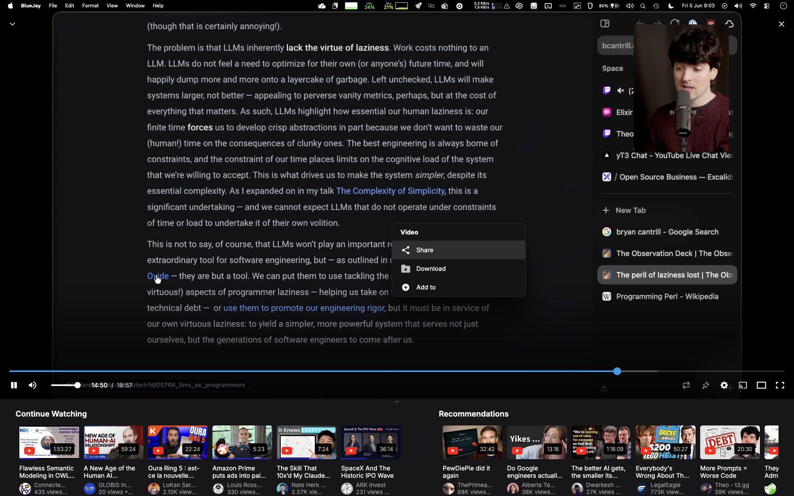
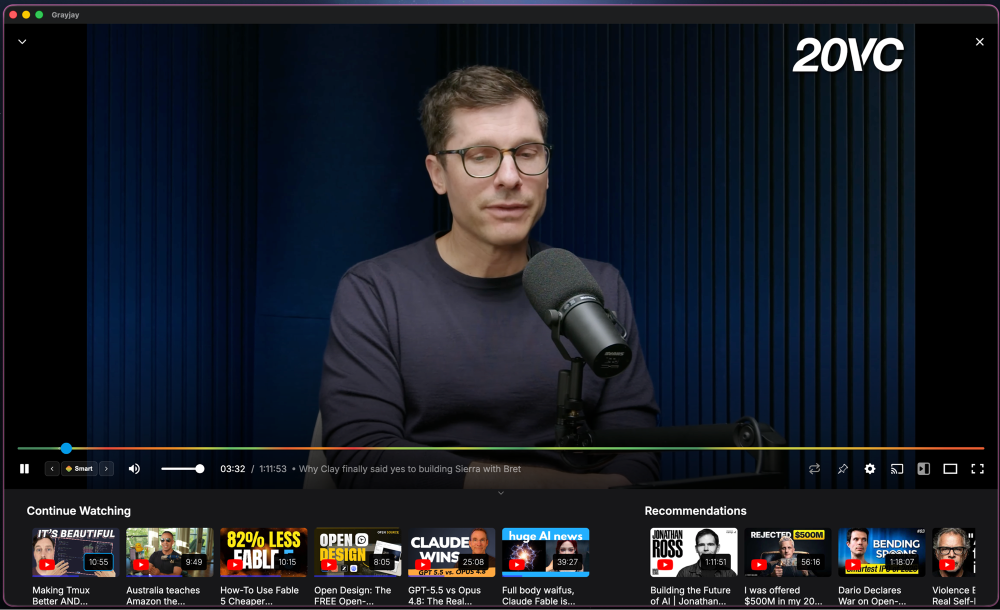

> ## A personal fork — with the deepest respect for [Grayjay](https://grayjay.app/) and [FUTO](https://futo.org/)
>
> This repository is a personal fork of [`futo-org/Grayjay.Desktop`](https://github.com/futo-org/Grayjay.Desktop). I'm not affiliated with FUTO in any way — just a heavy daily user who maintains a set of optional, local workflows on top of it.
>
> Grayjay is, very plainly, the application I use the most after my terminal. The team has built something genuinely useful — and they did it the hard way: open code, plugin architecture, no telemetry, no dark patterns, real respect for users. That deserves to be said out loud, and to be supported.
>
> ### Why a fork, then?
>
> Honestly, just to scratch a few of my own itches without imposing them on anyone. The changes here range from small quality-of-life tweaks (carousels under the player in theater mode, queue-consume on play, per-channel playback speed, hold-to-fast-forward, a `?` shortcuts overlay…) to optional local Smart Analysis workflows. Nothing replaces what FUTO does: these are personal additions for my own usage.
>
> ### Why no flood of PRs to upstream?
>
> Out of **respect**. I don't want to look like someone trying to muscle their ideas into a project they didn't build, especially when several of my changes are still settling and might evolve. I'd rather let things mature here, then propose them upstream calmly, one focused PR at a time, only when they feel ready and clearly useful to others — never as a take-it-or-leave-it batch.
>
> If FUTO maintainers ever want to look at any of these branches, **of course** I'd be happy to share, refactor as they wish, or simply close PRs that don't fit the project's direction. The decision is theirs.
>
> ### Why is this repo public, then?
>
> Mostly so my own builds across machines stay reproducible, and so anyone curious can see the diff. **It is not** an attempt to redistribute Grayjay, fork the community, or compete in any way. If at any point this fork ever risked confusing users about what "Grayjay" is, or pulling attention away from the official project, I'd rather make this repository private — that's a real line for me.
>
> ### What you should actually use
>
> The official Grayjay Desktop, from the official site:
> - **Website**: [grayjay.app/desktop](https://grayjay.app/desktop/)
> - **Upstream repo**: [github.com/futo-org/Grayjay.Desktop](https://github.com/futo-org/Grayjay.Desktop) (mirror of the primary GitLab)
> - **FUTO**: [futo.org](https://futo.org/)
>
> If you're a FUTO maintainer reading this and any of the above feels off, please [open an issue](https://github.com/guthubrx/Grayjay.Desktop/issues) or DM me — I'll adjust gladly.
>
> Thank you for Grayjay. Sincerely.
>
> — *guthubrx*
>
> ---
>
> *A handful of small personal tweaks ship with this fork — nothing that changes what Grayjay is. They're simply listed at the very bottom of this page: see **[Fork — additional features](#bluejay-fork--additional-features)** (EN) / **[Fork — fonctionnalités additionnelles](#fork-bluejay--fonctionnalités-additionnelles)** (FR).*

---

# Grayjay Desktop
Grayjay is a multi-platform media application that allows you to watch content from multiple platforms in a single application. Using an extendable plugin system developers can make new integrations with additional platforms. Plugins are cross-compatible between Android and Desktop.

FUTO is an organization dedicated to developing, both through in-house engineering and investment, technologies that frustrate centralization and industry consolidation.

For more elaborate showcase of features and downloads, check out the website.
Website: https://grayjay.app/desktop/

**NOTE for MacOS Users:** Our Apple signing/notarization is not entirely done yet, thus you have to run the following command once to run the application.
```
xattr -c ./Grayjay_osx-arm64.app

```
or
```
xattr -c ./Grayjay_osx-x64.app
```


### Home
Here you find the recommendations found on respective applications.


### Sources
Here you install new source plugins, change which sources are used, or configure your source behavior.


### Details
Here is an example of what the video player looks like, we support various views so that you can view the video how you like. By default we show a theater view that becomes smaller when reading comments, while not entirely hiding it.

|  |  |
|--|--|
|  |  |

### Downloads
Grayjay also supports downloads, allowing offline viewing of videos, as well as exporting them to files usable outside of Grayjay.


### Channel


### More..
Grayjay Desktop has way more features than this, but for that, check out the website or download it yourself!


## NixOS config

Below a NixOS configuration in case you like to use Grayjay on NixOS.
```
(pkgs.buildFHSEnv {
  name = "fhs";
  targetPkgs = _: with pkgs; [
    libz
    icu
    libgbm
    openssl # For updater

    xorg.libX11
    xorg.libXcomposite
    xorg.libXdamage
    xorg.libXext
    xorg.libXfixes
    xorg.libXrandr
    xorg.libxcb

    gtk3
    glib
    nss
    nspr
    dbus
    atk
    cups
    libdrm
    expat
    libxkbcommon
    pango
    cairo
    udev
    alsa-lib
    mesa
    libGL
    libsecret
  ];
}).env
```

---

## BlueJay fork — additional features

> This fork tracks Grayjay Desktop upstream and adds the features listed below. Everything else behaves like upstream Grayjay. Each feature is also kept as a standalone branch for potential upstream contribution.

### Home

- **Highlights home page** — a hero banner mixing your subscription videos with platform recommendations, plus content carousels. Switch between *Highlights* and the classic layout in *Settings → Home*.
- **Cached subscription-group rows** — group carousels render from the last known local data first, then refresh independently in the background. This keeps the Highlights page useful while subscription feeds are still loading.
- **Watch now** — unwatched subscription videos with Smart Analysis are ranked from their chapter-interest signal, alongside the normal recommendations.
- **Smart TV** — start a fixed, resumable session made from the strongest Smart Chapters across a pool of videos. A global mix and contextual tiles can appear before relevant rows; each session preserves its remaining chapters rather than rebuilding on every click.
- **Smart TV context** — when a session moves to another video, the player can show its title, channel and summary. Duration, video/section limits, score threshold, repeat-video penalty, tile artwork and intro behaviour are configurable in *Settings → Smart Analysis → Smart TV*.
- **Smarter Continue Watching** — finished videos (watched ≥ 90 %) and dismissed items are excluded from the carousel.
- **Mark Continue Watching items as watched** — mark as watched or remove from history straight from the Continue Watching carousel.
- **Targeted refresh** — the reload control distinguishes a quick local-cache reload from a complete source update.

### Player

- **Binge watch mode** — start a binge for a channel from its context menu (`...`); the queue refills dynamically as you watch, with a Next-Up overlay (also visible in fullscreen and window-maximized modes).
- **Queue consumed on play** — queued items are removed as they start playing.
- **Recommendations as a horizontal carousel** in theater mode (toggle).
- **Per-channel playback speed** — a speed override remembered per channel.
- **Hold to fast-forward** at a configurable speed (long press), with a speed chip overlay.
- **Multiple minimized players** — minimize several videos at once and switch between them.
- **Collapsible carousels** — collapse or expand the carousel sections under the player in theater mode, via a unified toggle bar.
- **Side-by-side carousels** — Continue Watching and Queue shown as side-by-side carousels under the player.
- **Remove from queue** — a toggle in the recommendations context menu to remove an item from the queue.
- **Video context menu** — right-click the video surface to access the same actions as the buttons under the player, including Share, Download and Add to.



### Smart Chapters (X-Ray)

- **AI-generated smart chapters** — an external command you configure (an LLM running on your own machine) analyses a video's transcript and produces titled, summarized chapters, each scored by how interesting it is. Trigger it from the video context menu.
- **Subtitle-first analysis, Whisper fallback** — when BlueJay already has subtitles, it passes them directly to the generator. Otherwise the generator tries available subtitles and can transcribe audio with Whisper. Transcript caching and coverage checks avoid repeating expensive work unnecessarily.
- **Resilient generation pipeline** — sections and theses scale with the duration, malformed model JSON is retried, very long catch-all sections are split again, and boundaries are snapped back to spoken-sentence starts.
- **Interest heatmap on the seekbar** — every chapter is colored on a continuous cold→hot scale (green = lighter, red = highly interesting), so the video's high points stand out at a glance.
- **Persistent Smart seekbar** — optionally keep the seekbar and heatmap visible after player controls fade, with adjustable drop and opacity.
- **X-Ray side panel** — the video's theses/topics, a global summary and per-chapter summaries, with adjustable font size, opacity and width.
- **Filter levels** — a vertical "thermometer" menu to jump through only the *Top*, *Strong*, *Good*, *Smart* or *All* moments.
- **Output language** — choose the language of the generated titles/summaries in *Settings → Smart Analysis*.
- **Interest signal across Highlights** — the global summary, chapter density and score profile are reused to surface an interest label/stars where relevant, rather than maintaining unrelated ratings.

For setup, scheduling and the exact Smart TV controls, see the [Smart Analysis guide](docs/bluejay-smart-analysis.en.md).

### Smart Block (experimental branch)

- **Promotion segments alongside SponsorBlock** — `pr/smart-block-promotions` adds optional, locally detected sponsor/self-promotion segments to the Smart Analysis output. They can be shown as a grey hatched overlay aligned with the Smart Chapters heatmap and skipped automatically when *Smart Block* is enabled.
- **Graceful fallback** — without a Smart Analysis file or Smart Block enabled, player behaviour stays unchanged; SponsorBlock remains independent.



### Video & navigation

- **In-app description links** — links in a video description (YouTube and other plugin-supported platforms) open the matching content *inside* the app, at the right timestamp when the URL carries one, instead of opening an external browser. Unsupported links still open in the browser.
- **Cmd/Ctrl+click opens a new window** — for videos, channels and playlists, including description links.
- **Subscription menu on the video page** — subscribe/unsubscribe from the video detail view.
- **Open channel minimizes the player** — opening a channel from a content menu minimizes the current video instead of closing it.
- **Add a channel to a subscription group** from the channel context menu.

### Search

- **Multi-sort with priority order** — client-side sorting of results by several criteria.

### Subscriptions

- **Multi-select subscription groups** with batch copy/move actions.
- **Local recommendations** derived from your own subscriptions.

### Keyboard

- **Shortcuts overlay** — press `?` to display all shortcuts.
- **Theater toggle** (`t`), **playback speed** (`<` / `>`), reload Home/Subscriptions, `Esc` to exit window-maximized mode.
- **Customizable shortcuts**.

---

## Fork BlueJay — fonctionnalités additionnelles

> Ce fork suit Grayjay Desktop en amont et ajoute les fonctionnalités ci-dessous. Tout le reste se comporte comme Grayjay original. Chaque fonctionnalité est aussi conservée sur une branche dédiée en vue d'une éventuelle contribution upstream.

### Accueil

- **Page d'accueil Highlights** — une bannière héro mêlant les vidéos de vos abonnements et les recommandations des plateformes, plus des carrousels de contenu. Bascule entre *Highlights* et la disposition classique dans *Paramètres → Accueil*.
- **Lignes de groupes d'abonnements mises en cache** — les carrousels de groupes s'affichent d'abord depuis les dernières données locales, puis se rafraîchissent indépendamment en arrière-plan. La page Highlights reste ainsi exploitable pendant le chargement des flux.
- **Watch now** — les vidéos non vues de vos abonnements déjà analysées sont classées à partir du signal d'intérêt de leurs chapitres, à côté des recommandations habituelles.
- **Smart TV** — lancez une session fixe et reprenable composée des meilleurs Smart Chapters d'un ensemble de vidéos. Un mix global et des tuiles contextuelles peuvent apparaître au début des lignes ; une session conserve les chapitres restants au lieu d'être reconstruite à chaque clic.
- **Contexte Smart TV** — au passage à une autre vidéo, le lecteur peut afficher son titre, sa chaîne et son résumé. La durée, les limites de vidéos/chapitres, le score minimal, la pénalité de répétition, les miniatures et le comportement de l'introduction se règlent dans *Paramètres → Smart Analysis → Smart TV*.
- **Continue Watching amélioré** — les vidéos terminées (vues ≥ 90 %) et les éléments masqués sont exclus du carrousel.
- **Marquer les éléments Continue Watching comme vus** — marquer comme vu ou retirer de l'historique directement depuis le carrousel Continue Watching.
- **Rafraîchissement ciblé** — le contrôle de rechargement distingue un rechargement rapide depuis le cache local d'une mise à jour complète des sources.

### Lecteur

- **Mode binge watch** — démarrez un binge pour une chaîne depuis son menu contextuel (`...`) ; la file se réalimente dynamiquement à mesure que vous regardez, avec une superposition Next-Up (visible aussi en plein écran et en fenêtre maximisée).
- **File consommée à la lecture** — les éléments en file sont retirés dès qu'ils commencent.
- **Recommandations en carrousel horizontal** en mode théâtre (activable).
- **Vitesse de lecture par chaîne** — une vitesse mémorisée pour chaque chaîne.
- **Avance rapide maintenue** à une vitesse configurable (appui long), avec une pastille de vitesse.
- **Plusieurs lecteurs minimisés** — minimisez plusieurs vidéos à la fois et basculez de l'une à l'autre.
- **Carrousels repliables** — repliez ou dépliez les sections de carrousels sous le lecteur en mode théâtre, via une barre de bascule unifiée.
- **Carrousels côte à côte** — Continue Watching et la file affichés en carrousels côte à côte sous le lecteur.
- **Retirer de la file** — une bascule dans le menu contextuel des recommandations pour retirer un élément de la file.
- **Menu contextuel vidéo** — clic droit sur la vidéo pour accéder aux mêmes actions que les boutons sous le lecteur, dont Partager, Télécharger et Ajouter à.

### Smart Chapters (X-Ray)

- **Chapitres intelligents générés par IA** — une commande externe que vous configurez (un LLM tournant sur votre propre machine) analyse la transcription d'une vidéo et produit des chapitres titrés et résumés, chacun noté selon son intérêt. Déclenchez-la depuis le menu contextuel de la vidéo.
- **Analyse sous-titres d'abord, Whisper en repli** — quand BlueJay possède déjà les sous-titres, il les transmet directement au générateur. Sinon, le générateur essaie les sous-titres disponibles puis peut transcrire l'audio avec Whisper. Le cache et le contrôle de couverture de transcription évitent de refaire inutilement les traitements coûteux.
- **Pipeline de génération robuste** — le nombre de sections et de thèses suit la durée, les JSON malformés du modèle sont réessayés, les longues sections fourre-tout sont redécoupées et les bornes sont recalées sur les débuts de phrases prononcées.
- **Carte de chaleur d'intérêt sur la barre** — chaque chapitre est coloré sur une échelle continue froid→chaud (vert = léger, rouge = très intéressant), pour repérer les temps forts d'un coup d'œil.
- **Barre Smart persistante** — possibilité de conserver la barre de progression et sa heatmap après la disparition des contrôles, avec décalage et opacité réglables.
- **Panneau latéral X-Ray** — les thèses/sujets de la vidéo, un résumé global et des résumés par chapitre, avec taille de police, opacité et largeur ajustables.
- **Niveaux de filtre** — un menu « thermomètre » vertical pour ne parcourir que les moments *Top*, *Strong*, *Good*, *Smart* ou *All*.
- **Langue de sortie** — choisissez la langue des titres/résumés générés dans *Paramètres → Smart Analysis*.
- **Signal d'intérêt réutilisé dans Highlights** — le résumé global, la densité de chapitres et leurs scores servent à afficher un niveau d'intérêt cohérent, plutôt que de maintenir plusieurs notations indépendantes.

Pour l'installation, la planification et le détail des contrôles Smart TV, consultez le [guide Smart Analysis](docs/bluejay-smart-analysis.fr.md).

### Smart Block (branche expérimentale)

- **Segments promotionnels en complément de SponsorBlock** — `pr/smart-block-promotions` ajoute au résultat Smart Analysis des segments locaux de sponsor/autopromotion. Ils peuvent apparaître en gris hachuré, alignés sur la heatmap Smart Chapters, puis être sautés automatiquement lorsque *Smart Block* est activé.
- **Dégradation propre** — sans fichier Smart Analysis ou sans Smart Block activé, le comportement du lecteur ne change pas ; SponsorBlock reste indépendant.


### Vidéo & navigation

- **Liens de description ouverts dans l'app** — les liens d'une description vidéo (YouTube et autres plateformes gérées par les plugins) ouvrent le contenu correspondant *dans* l'application, au bon timestamp si l'URL en contient un, au lieu d'ouvrir un navigateur externe. Les liens non gérés ouvrent toujours le navigateur.
- **Cmd/Ctrl+clic ouvre une nouvelle fenêtre** — pour les vidéos, chaînes et playlists, y compris les liens de description.
- **Menu d'abonnement sur la page vidéo** — s'abonner/se désabonner depuis la vue détaillée.
- **Ouvrir une chaîne minimise le lecteur** — ouvrir une chaîne depuis un menu de contenu minimise la vidéo en cours au lieu de la fermer.
- **Ajouter une chaîne à un groupe d'abonnements** depuis le menu contextuel de la chaîne.

### Recherche

- **Tri multiple avec ordre de priorité** — tri côté client des résultats selon plusieurs critères.

### Abonnements

- **Sélection multiple de groupes d'abonnements** avec actions de copie/déplacement en lot.
- **Recommandations locales** dérivées de vos propres abonnements.

### Clavier

- **Aperçu des raccourcis** — appuyez sur `?` pour afficher tous les raccourcis.
- **Bascule théâtre** (`t`), **vitesse de lecture** (`<` / `>`), rechargement Accueil/Abonnements, `Échap` pour quitter le mode fenêtre maximisée.
- **Raccourcis personnalisables**.
